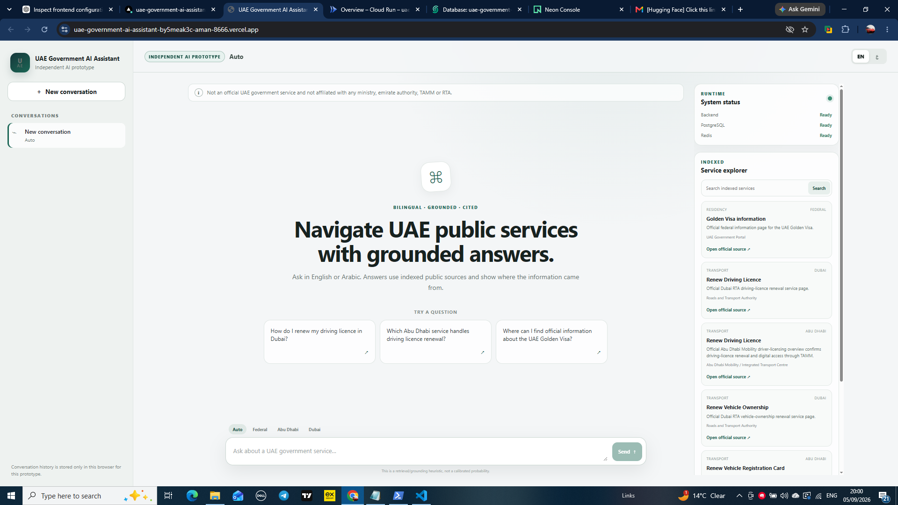
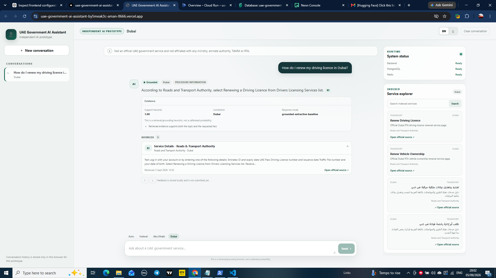
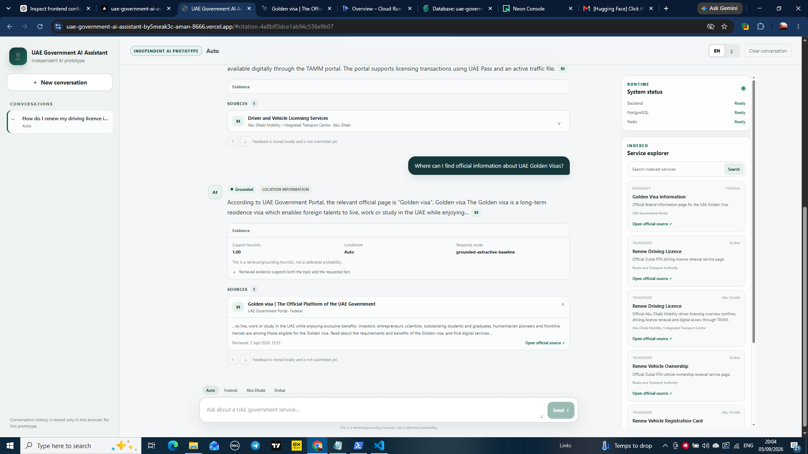

# UAE Government AI Assistant

[](https://uae-government-ai-assistant.vercel.app) [](experiments/evaluation/milestone9_deployment_results.json) [](docs/milestone10.md)

Production-style bilingual Arabic/English public-service information assistant for UAE Federal, Dubai and Abu Dhabi government services.

> **Independent portfolio and research project.**
> This is not an official UAE government service and is not affiliated with the UAE Government, TAMM, Dubai Digital Authority, or any UAE ministry or government organisation.

## Live Demo

**Frontend:**
https://uae-government-ai-assistant.vercel.app



The deployed application supports:

- English and Arabic interfaces
- Arabic RTL / English LTR layouts
- Federal, Dubai and Abu Dhabi jurisdiction handling
- grounded public-service Q&A
- official-source citation cards
- service discovery
- backend/database/cache health indicators
- browser-local conversation history

## System Overview

The project implements a production-oriented retrieval-augmented generation system over a curated set of official UAE public-service information sources.

```text
Browser
   |
   v
Vercel
Next.js / TypeScript
   |
   | same-origin server proxy
   v
Google Cloud Run
FastAPI / Python
   |
   +--------------------+
   |                    |
   v                    v
Neon PostgreSQL      Upstash Redis
+ pgvector           cache / rate limit
```

### Production infrastructure

| Component | Deployment |
|---|---|
| Frontend | Vercel |
| Backend API | Google Cloud Run |
| Database | Neon PostgreSQL + pgvector |
| Cache / rate limiting | Upstash Redis |
| Container registry | Google Artifact Registry |
| Secret storage | Google Secret Manager |

The production backend uses the local `intfloat/multilingual-e5-small` embedding model baked into the container image and a conservative extractive generation path, so the public demo does not require a hosted LLM API key.


For the detailed production request path and trust boundaries, see [`docs/portfolio_architecture.md`](docs/portfolio_architecture.md).

## Core Architecture

### Backend

- Python
- FastAPI
- SQLAlchemy
- Alembic
- PostgreSQL
- pgvector
- Redis
- structured JSON logging
- request IDs
- security middleware
- operational telemetry

### Retrieval and RAG

- multilingual E5 embeddings
- BM25 lexical retrieval
- pgvector dense retrieval
- hybrid retrieval using reciprocal-rank fusion
- reranking
- jurisdiction-aware filtering
- Arabic and English query handling
- grounded answer generation
- backend-constructed citations
- insufficient-evidence refusal
- prompt-injection separation for retrieved content

### Agent Layer

The system also includes a bounded read-only service-discovery agent with:

- allow-listed tools
- explicit tool-call limits
- structured government-service records
- jurisdiction-aware service lookup
- inspectable tool traces

The agent is intentionally constrained and does not perform government transactions or modify external systems.

### Frontend

- Next.js
- TypeScript
- App Router
- responsive UI
- Arabic RTL / English LTR
- citation cards
- grounding indicators
- jurisdiction controls
- service explorer
- browser-local conversation history
- same-origin Next.js → FastAPI proxy

## Data

The deployed corpus contains **12 enabled official sources** covering:

| Jurisdiction | Sources |
|---|---:|
| Federal | 5 |
| Dubai | 3 |
| Abu Dhabi | 4 |

Language distribution:

| Language | Sources |
|---|---:|
| English | 7 |
| Arabic | 5 |

The structured service catalogue currently contains **11 verified services**.

All enabled deployment sources passed the corpus audit before production deployment.

## Milestone 7 — Frozen Evaluation

Milestone 7 is frozen and should be treated as the final automated evaluation baseline for this version of the system.

### Retrieval evaluation

130 answerable queries:

| Metric | Result |
|---|---:|
| Recall@5 | **1.000** |
| Precision@5 | **0.200** |
| MRR | **0.941026** |
| NDCG@5 | **0.956408** |

### End-to-end evaluation

180 English, Arabic and mixed-language cases:

| Metric | Result |
|---|---:|
| Status accuracy | **1.000** |
| Language accuracy | **1.000** |
| Expected fact coverage | **1.000** |
| Citation correctness | **1.000** |
| Citation completeness | **1.000** |
| Context fact coverage | **0.984615** |
| Lexical relevance | **0.680736** |

These are engineering evaluation metrics over the project's fixed benchmark and should not be interpreted as universal real-world accuracy guarantees.

### Qualitative evaluation

The qualitative evaluation contains 30 samples:

- 10 samples were manually reviewed by the developer.
- 20 Arabic/mixed-language samples were AI-assisted because the developer does not independently read Arabic.

The project therefore does **not** describe the dataset as 30 independent human reviews.

Recorded mean scores:

| Dimension | Mean |
|---|---:|
| Faithfulness | 4.50 / 5 |
| Answer relevance | 4.60 / 5 |
| Citation completeness | 4.50 / 5 |
| Language quality | 4.43 / 5 |

See `docs/milestone7.md` and the checked-in evaluation result files for methodology and limitations.

## Milestone 8 — Production Engineering

Milestone 8 introduced:

- Redis-backed response caching
- deterministic hashed cache keys
- TTL and cache-version invalidation
- Redis-backed rate limiting
- structured privacy-aware logging
- request IDs
- model/token/cost telemetry
- guarded operational metrics
- request-body size limits
- trusted-host enforcement
- security headers
- production configuration validation
- concurrency/performance tooling
- source secret-audit tooling

Final pre-deployment verification:

```text
Ruff: clean
mypy: no issues in 76 source files
pytest: 111 tests passed
security audit: passed
```

## Milestone 9 — Production Deployment

Milestone 9 is complete.

The production deployment uses:

```text
Vercel
   ↓
Next.js server-side proxy
   ↓
Google Cloud Run / FastAPI
   ↓
Neon PostgreSQL + pgvector
   +
Upstash Redis
```

The production deployment verifier performs public checks against both the frontend and backend.

Final result:

```text
PASS backend readiness
PASS backend request/security headers
PASS frontend root
PASS frontend-to-backend proxy
PASS end-to-end grounded chat
PASS operational metrics require authentication

passed: true
```

The verified public deployment confirmed:

- Cloud Run HTTP readiness
- PostgreSQL connectivity
- Redis connectivity
- security/request headers
- public Vercel frontend availability
- Next.js → FastAPI proxy connectivity
- grounded Federal chat response
- returned source citation
- authentication enforcement on operational metrics

The machine-readable verification result is stored at:

```text
experiments/evaluation/milestone9_deployment_results.json
```

## Example Questions

Try:

```text
How do I renew my driving licence in Dubai?

How do I renew my driving licence in Abu Dhabi?

Where can I find official information about UAE Golden Visas?
```

Arabic queries and the Arabic RTL interface are also supported.

## Portfolio Screenshots

### Dubai grounded answer



### Federal Golden Visa answer



The screenshots above are captured from the real deployed application. No Arabic screenshot is included here because one was not captured for this portfolio bundle.

## API

Main endpoints:

```text
POST /api/v1/chat
POST /api/v1/search

GET  /api/v1/services
GET  /api/v1/services/{id}

GET  /api/v1/sources
GET  /api/v1/sources/{id}

POST /api/v1/agent/service-discovery

GET  /api/v1/health
GET  /api/v1/ready
```

Operational metrics are separately protected and are not publicly exposed without authentication.

## Local Development

### Infrastructure

```powershell
Copy-Item .env.example .env
docker compose up -d --build

cd backend
alembic upgrade head
```

Do not use production credentials in the local `.env`.

### Backend

```powershell
cd backend

python -m pip install -e ".[dev,ml]"

ruff check .
mypy app
python -m pytest -q
```

### Frontend

```powershell
cd frontend

Copy-Item .env.local.example .env.local

npm install
npm run lint
npm run typecheck
npm run build
npm run dev
```

The frontend communicates with FastAPI through a server-side Next.js proxy configured with:

```text
BACKEND_INTERNAL_URL
```

The backend URL is therefore not exposed through a `NEXT_PUBLIC_*` browser variable.

## Data Ingestion

List configured sources:

```powershell
python scripts\ingest.py --list-sources
```

Run jurisdiction-specific ingestion:

```powershell
python scripts\ingest.py --jurisdiction Federal
python scripts\ingest.py --jurisdiction Dubai
python scripts\ingest.py --jurisdiction "Abu Dhabi"
```

Audit the resulting corpus:

```powershell
python scripts\audit_corpus.py
```

Seed verified structured services:

```powershell
python scripts\seed_services.py
```

## Evaluation

Key evaluation utilities:

```powershell
python scripts\evaluate.py
python scripts\evaluate_rag.py
python scripts\evaluate_m7_retrieval_live.py
python scripts\evaluate_m7_live.py
python scripts\performance_m8.py
python scripts\security_audit_m8.py
python scripts\verify_deployment_m9.py --help
```

The frozen Milestone 7 metrics should not be regenerated and silently substituted with new values when documenting this version.

## Repository Structure

```text
backend/
    app/
    alembic/
    tests/

frontend/
    app/
    components/
    lib/

data/
    evaluation/
    manifests/
    services/

docs/

experiments/
    evaluation/
    rag/
    retrieval/

scripts/

docker-compose.yml
```

## Documentation

Detailed documentation is available in:

```text
docs/architecture.md
docs/data_sources.md
docs/evaluation.md
docs/agent_tools.md
docs/model_card.md
docs/corpus_expansion.md
docs/deployment.md
docs/milestone1.md
docs/milestone2.md
docs/milestone3.md
docs/milestone4.md
docs/milestone5.md
docs/milestone6.md
docs/milestone7.md
docs/milestone8.md
docs/milestone9_deployment.md
docs/milestone10.md
docs/portfolio_architecture.md
docs/portfolio_deployment.md
docs/portfolio_evaluation.md
docs/portfolio_model_card.md
docs/responsible_ai.md
docs/demo_video.md
```

## Security and Privacy

The project is designed as an informational assistant rather than an authoritative decision-making system.

Production engineering includes:

- no raw-query logging in operational telemetry
- no generated-answer text logging in operational metrics
- no client-IP recording in operational metrics
- secret storage through Google Secret Manager
- authenticated operational metrics
- trusted-host validation
- security headers
- request-size limits
- rate limiting

Real deployment credentials are not stored in the repository.

## Limitations

The assistant operates over a deliberately bounded corpus and should not be treated as a complete representation of all UAE government services.

Government requirements, fees, eligibility rules, procedures and URLs can change. Users should confirm important information through the cited official source before acting.

The current public demo uses conservative extractive generation. It is designed to favour groundedness and refusal over unsupported free-form generation.

The application does not submit applications, perform payments, modify government records or act on behalf of a user.

## Responsible Use

This system is intended to demonstrate AI engineering, information retrieval, multilingual RAG and production deployment techniques.

It is not intended to replace official government portals, legal advice, immigration advice or authoritative eligibility decisions.

## License

See `LICENSE`.

## Project Status

**Milestones 1–10 complete.**

The repository is now in its portfolio-polished state with a verified public deployment, frozen evaluation results, production-engineering evidence, architecture documentation, responsible-AI disclosures and real application screenshots.
