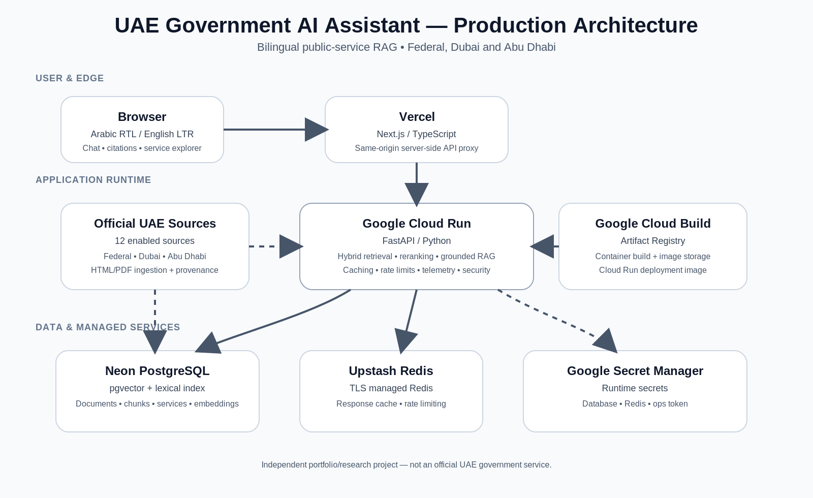

# Production Architecture

## Overview

The UAE Government AI Assistant is deployed as a split frontend/backend application with managed data services.



If the PNG is not available in a Markdown viewer, the source SVG is available at `docs/assets/architecture.svg`.

## Request path

1. A user opens the public Next.js application on Vercel.
2. Browser requests remain same-origin and are sent to the Next.js server-side proxy under `/api/backend/*`.
3. The proxy forwards requests to the FastAPI service running on Google Cloud Run.
4. FastAPI uses Neon PostgreSQL + pgvector for structured service data, lexical retrieval and dense vector retrieval.
5. Upstash Redis provides response caching and distributed rate limiting.
6. Runtime credentials are injected through Google Secret Manager.
7. The Cloud Run image is built using Google Cloud Build and stored in Artifact Registry.

## Retrieval and answer path

```text
User query
   ↓
Language / jurisdiction handling
   ↓
Hybrid retrieval
   ├─ BM25 / PostgreSQL lexical search
   └─ multilingual E5 / pgvector dense search
   ↓
Reciprocal-rank fusion
   ↓
Reranking
   ↓
Grounding / support checks
   ↓
Conservative extractive answer
   ↓
Backend-constructed citations
```

The public deployment intentionally uses a conservative extractive generation path. This reduces dependence on a hosted LLM and prioritises source-grounded answers and refusal when evidence is insufficient.

## Production components

| Layer | Component | Purpose |
|---|---|---|
| UI | Vercel / Next.js | Bilingual frontend and same-origin proxy |
| API | Google Cloud Run / FastAPI | Retrieval, RAG, services, tools and operational controls |
| Database | Neon PostgreSQL | Documents, chunks, services and retrieval metadata |
| Vector search | pgvector | multilingual E5 chunk embeddings |
| Cache / control | Upstash Redis | response cache and rate limiting |
| Secrets | Google Secret Manager | database, Redis and operational credentials |
| Build | Cloud Build + Artifact Registry | reproducible container build and image storage |

## Trust boundaries

The browser never receives the production database or Redis credentials. `BACKEND_INTERNAL_URL` is used only by the Next.js server-side proxy and is not a `NEXT_PUBLIC_*` variable.

The backend validates trusted hosts, applies request-size limits and security headers, and protects operational metrics with authentication.

## Scope

This architecture supports an informational assistant only. It does not submit applications, perform payments, modify government systems or make authoritative eligibility decisions.
